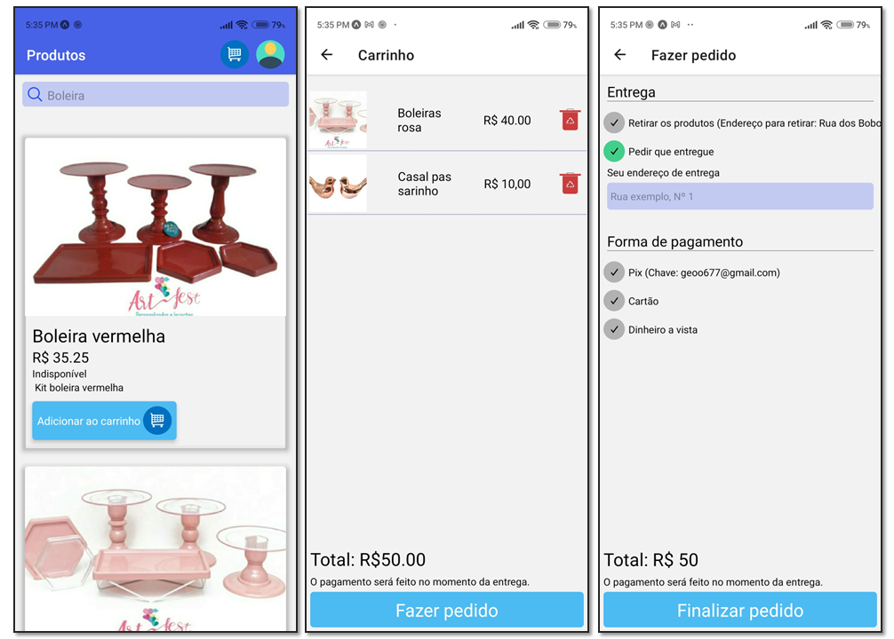
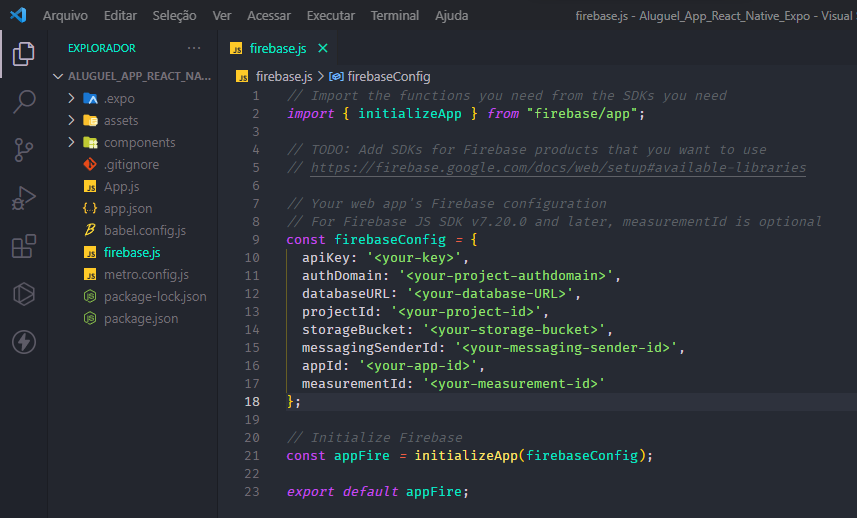

# App AlugeulApp com React Native Expo + Firebase

Neste aplicativo desenvolvido com React Native Expo e FireBase, as pessoas podem fazer pedidos de aluguel de produtos. Quem é administrador também pode cadastrar, listar, editar e remover produtos, listar e alterar os status dos pedidos. O aplicativo também possui carrinho de compras.

## Execução

Instalação de dependências: `npm install`
Executando o aplicativo: `expo start` ou `npm start`

Este projeto usa o Firebase para armazenar imagens e dados de produtos, dados do usuário e autenticação. Portanto, você precisa passar as configurações do Firebase para o arquivo firebase.js, conforme mostrado na imagem a seguir:

