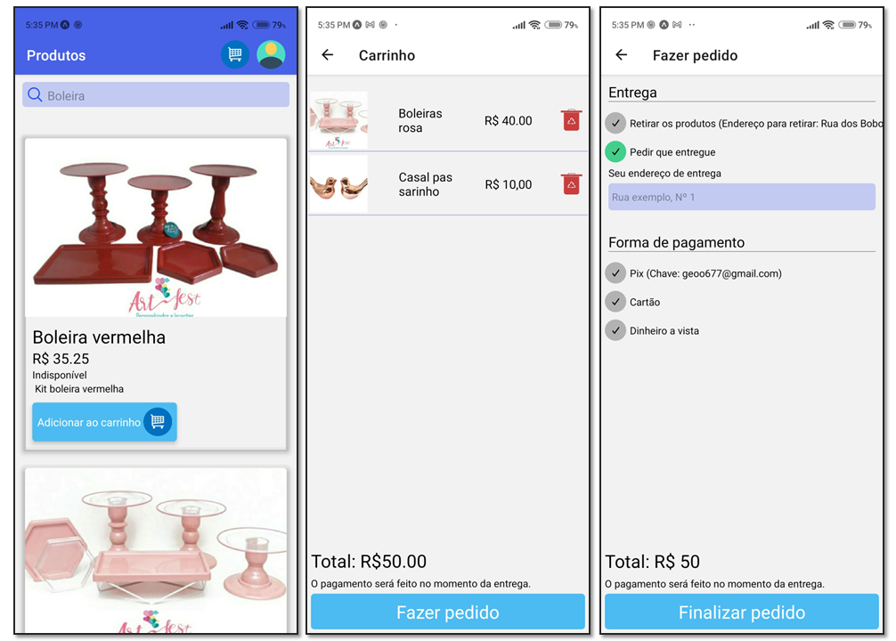
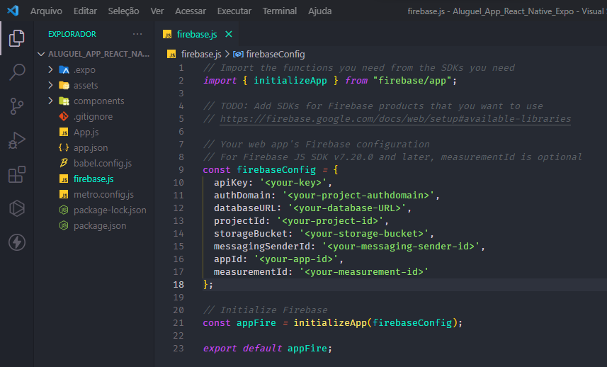

# App AlugeulApp By React Native Expo

In this app powered by React Native Expo and FireBase, people can place orders for product rentals. Who is an administrator can also register, list, edit and remove products, list and change order status. The application also has a shopping cart.

## Execution

Installation of dependencies: `npm install`
Running the app: `expo start` or `npm start`

This project uses Firebase to store product images and data, user data, and authentication, so you need to pass Firebase settings to the firebase.js file as shown in the following image:

